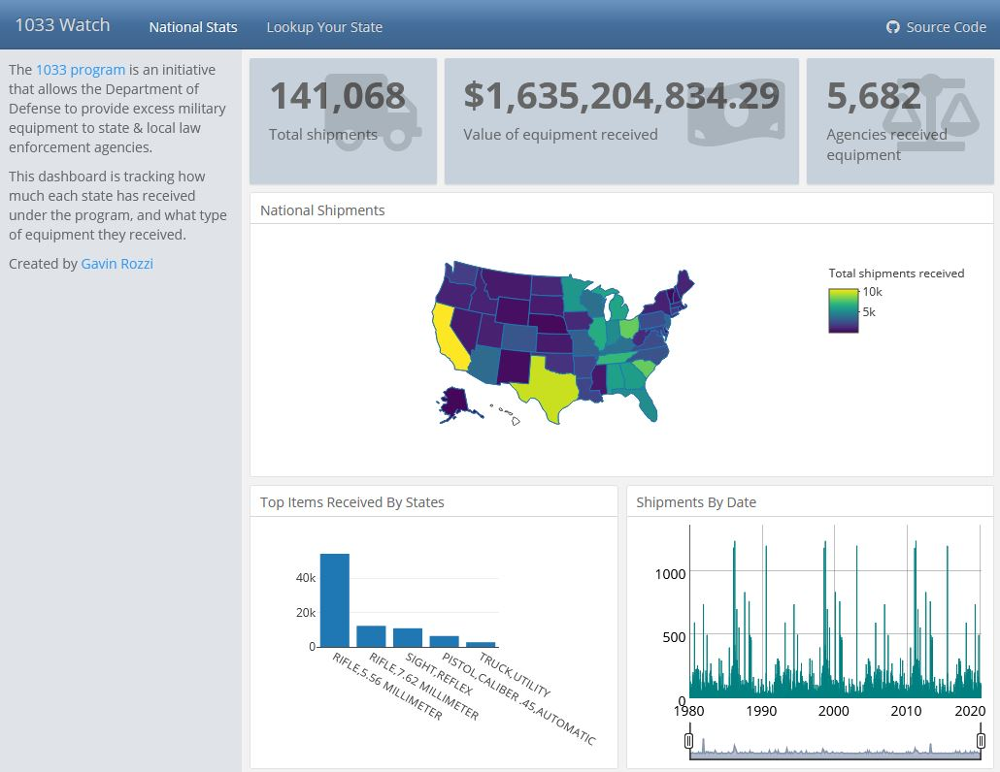

# 1033 Watch

1033 Watch is an interactive dashboard tracking shipments of military hardware from the Defense Logistics Agency to state and local law enforcement agencies under the 1033 Program.

The 1033 program is an initiative whereby the Department of Defense provides excess military hardware to local law enforcement. The military hardware is provided free of charge, but states are required to cover the cost of shipping.

Amid recent protests, the program has been criticized for encouraging the militarization of police. This dashboard was created to track shipments under the program and evaluate its impact.

The data that powers this dashboard was obtained from the public Defense Logistics Agency Website. The Excel sheet was processed into the file data.csv from the official 1033 Program Excel spreadsheet which is then displayed in the dashboard.